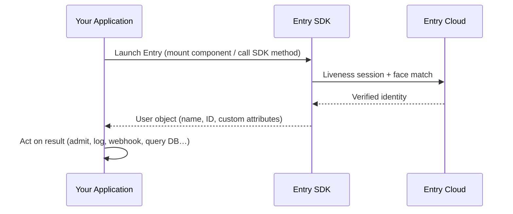
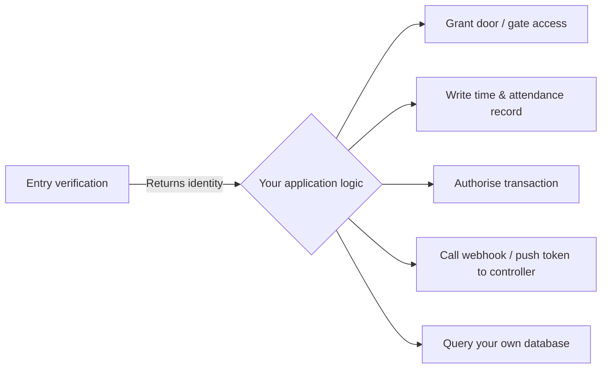
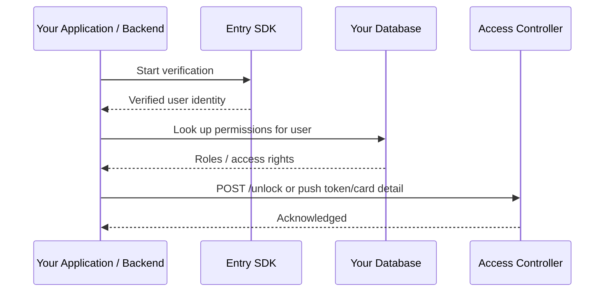

# Integrating with Entry

Entry is a **biometric identity verification SDK**. It answers a single question: *who is in front of the camera right now?* What your application does with that answer — granting access, logging attendance, triggering a transaction — is entirely up to you.

## The integration model



Your application is always in control:

1. You **launch** Entry by calling the SDK.
2. Entry **verifies** the person is live and matches a registered face.
3. Entry **returns** the registered user's identity to your application.
4. You **decide** what to do next.

Entry never grants or denies access itself. It only identifies.

---

## What Entry returns

After a successful verification, the SDK resolves with a user object containing the registered identity:

```json
{
  "userId": "usr_01J...",
  "displayName": "Jane Smith",
  "metadata": { }
}
```

You can attach arbitrary metadata to a user at registration time (employee ID, card number, role, etc.) and it will be returned on every successful verification.

---

## Your application's responsibility



Entry provides **identity**. Everything else — permissions, roles, access assignments, database queries, webhook calls — is handled by your system using your existing infrastructure.

This means:

- **Existing databases are not replaced.** Your Postgres, SQL Server, or any other database remains the source of truth for roles and permissions. Entry tells you *who* is present; your database tells you *what they are allowed to do*.
- **Existing access control systems are not replaced.** Entry plugs in as the identity-verification step. Once you have a verified identity, you push that identity to your controller, door system, or access management platform using whatever mechanism it already supports (webhook, REST call, token, card detail lookup, etc.).

---

## Webhook and controller integration pattern

A common pattern for physical access control:



Entry does not communicate directly with access controllers. Your backend receives the verified identity and is responsible for any downstream calls.

---

## Database compatibility

Entry does not connect to your database. It is a UI SDK that returns an identity. You query your own database *after* receiving the identity from Entry.

This means Entry is compatible with any database — Postgres, MySQL, SQL Server, MongoDB, or anything else — because the integration point is your own application code, not a direct database connection.

---

## Quick-start (Web)

```ts
import { EntrySDK } from '@synapser-sdk-distribution/entry-web-sdk';

const sdk = EntrySDK.getInstance({
  appName: 'MyApp',
  environment: 'live',
  containerElementId: 'entry-container',
});

try {
  const user = await sdk.identifyUser();
  // user.userId, user.displayName, user.metadata are now available
  // → query your DB, call your webhook, update your access log, etc.
} catch (err) {
  // handle EntrySDKError
}
```

See the platform-specific guides for full setup instructions:

- [Web integration](web.md)
- [iOS integration](ios.md)
- [Android integration](android.md)
- [React Native integration](react-native.md)

---

## Summary

| Concern                                  | Who handles it                        |
| ---------------------------------------- | ------------------------------------- |
| Is this person live (not a photo/video)? | Entry                                 |
| Does their face match a registered user? | Entry                                 |
| Who are they?                            | Entry returns this                    |
| What are they allowed to do?             | Your application                      |
| Roles, permissions, access levels        | Your database / access control system |
| Webhooks, door controllers, token push   | Your backend                          |
| Time & attendance records                | Your application                      |
